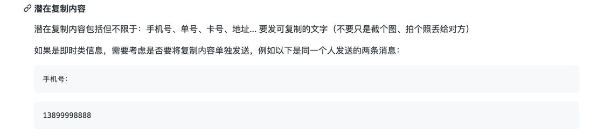
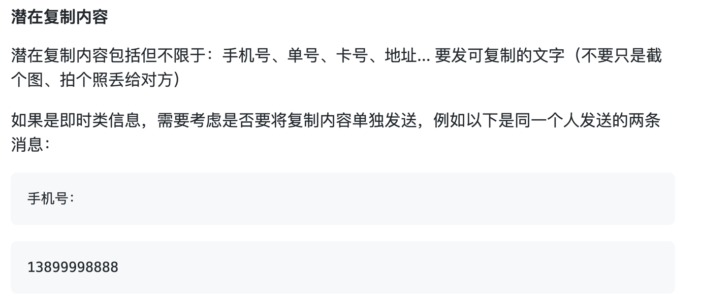
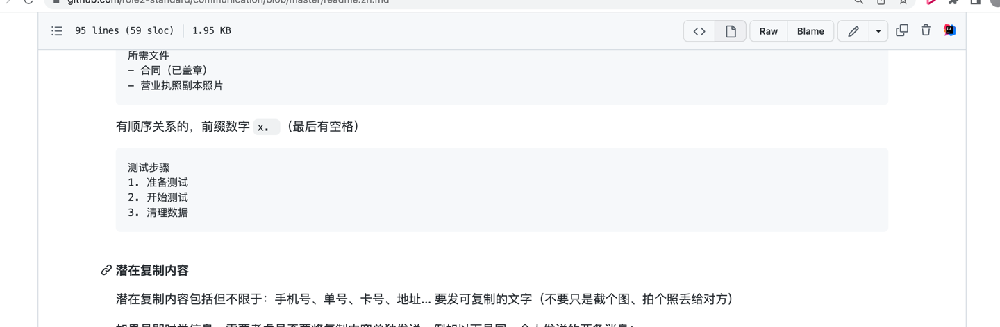
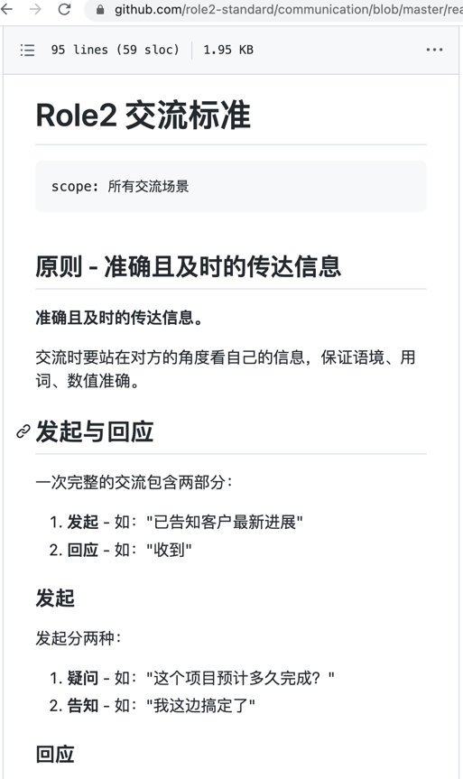

[中文](./readme.zh.md)

# Role2 Communication Standards

```text
scope: All communication scenarios
```

## Principle: accurate and timely

Stand in others' shoes and check your own expression. Make sure context, wording and numbers are correct.

## A successful communication consists of two parts

1. **Initiation** e.g. "Client has been updated"
2. **Response** e.g. "Received"

### Initiation

There are two possibilities for initiation:

1. **Query** e.g. "How long is this project expected to take to complete?"
2. **Inform** e.g. "I'm done here"

### Response

The response should do the following:

1. **certain**
2. **on time**

#### Certainty - There will always be a response

Response is compulsory no matter what initiation is:

> Initiation: "I'm done."
>
> Response: "ok" (Respond regardless of whether the other party needs to respond or not.)

If you don't know how to answer it right away, you should still respond and then look it up:

> Initiation: "Is it ok to sign without stamping at the end of the document?"
>
> Response: "Let me check" (Respond even if you don't know the answer)

#### Timely - Respond ASAP

**Instant response: phone calls, text messages, anything.** No need to wait.

## Graphic and text communication

Hybrid communication medium including email, instant messaging and more.

### Format - Clear and Consistent

**Clear and consistent format for communication.**

#### List

One entry each line. For unordered list, please add `- ` prefix (don't forget the space).

```text
Documents Reuired
- Contract (stamped)
- Photocopy of the business license
```

For ordered list, please add number prefix `x. ` (don't forget the space).

```text
Steps
1. Prepare for the test
2. Start the test
3. Clear the data
```

#### Screenshot - Be clear at a glance

Remember to take other screen sizes into consideration, try to make it clear for everyone without zooming.

If it contains lots of text, better zoom in first then take the screenshot.

**If you are using a browser, simply use `ctrl +` (Windows) or `⌘ +` (macOS) to zoom in/out** (`+` for zoom in，`-` for zoom out).

Before applying such method:



After:



Adjust the browser window before taking a screenshot:

Before:



After:



#### Content that potentially worth copying

Phone number, receipt number, card id, address, etc. They should be sent in text format rather than photos or screenshots.

For instant messages, you may want to put such content in a new line. Below is an example of two messages sent by the same person:

```text
Phone number:
```

```text
13899998888
```

The second one is easier to copy as there's no redundant information.
