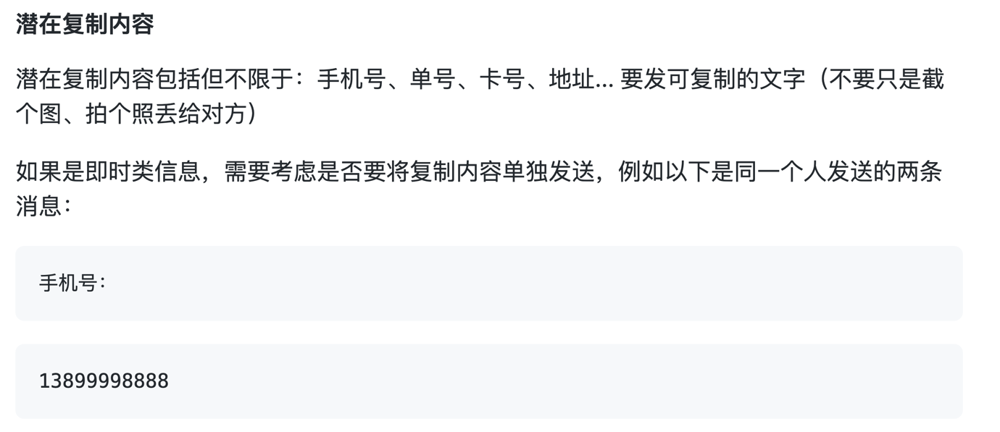

[English](./readme.md)

# Role2 交流标准

```text
scope: 所有交流场景
```

## 原则 - 准确且及时的传达信息

**准确且及时的传达信息。**

交流时要站在对方的角度看自己的信息，保证语境、用词、数值准确。

## 发起与回应

一次完整的交流包含两部分：

1. **发起** - 如："已告知客户最新进展"
2. **回应** - 如："收到"

### 发起

发起分两种：

1. **疑问** - 如："这个项目预计多久完成？"
2. **告知** - 如："我这边搞定了"

### 回应

回应要做到：

1. **确定**
2. **及时**

#### 确定 - 必有回响

无论是哪种发起，都需要回应：

> 发起："我搞定了"
>
> 回应："ok"（不管对方需不需要回应，都要回应）

对于眼下不知道答案，需要时间调查了解的，也需要及时回应：

> 发起："文件末尾只签字不盖章可以吗？"
>
> 回应："我查查"（就算不知道也要及时回应）

#### 及时 - 尽快响应

**电话能秒接就秒接，消息能秒回就秒回。** 响三下才接，等几秒再回这类"礼节"一律省去。

## 图文类交流

包括电子邮件，手机短信，即时通信等图文类交流媒介。

### 格式

要保证清晰一致的格式。

#### 列表类

每行一条，没有顺序关系的，前缀 `- ` （最后有空格）

```text
所需文件
- 合同（已盖章）
- 营业执照副本照片
```

有顺序关系的，前缀数字 `x. ` （最后有空格）

```text
测试步骤
1. 准备测试
2. 开始测试
3. 清理数据
```

#### 截图

要考虑到对方的屏幕尺寸，尽量让人家无需缩放就能看清所有信息。

如果是文字类截图最好缩放页面后截图

**如果是浏览器，可以直接 `ctrl +` 或 `⌘ +` 缩放页面文字**

优化前：


优化后：



将浏览器窗口变窄后再截图：

优化前：


优化后：


#### 潜在复制内容

潜在复制内容包括但不限于：手机号、单号、卡号、地址... 要发可复制的文字（不要只是截个图、拍个照丢给对方）

如果是即时类信息，需要考虑是否要将复制内容单独发送，例如以下是同一个人发送的两条消息：

```text
手机号：
```

```text
13899998888
```

由于第二条没有干扰信息，就更好复制。
